# Pullit Entity Relationship Diagram - 전체 필드 포함

## 상세 ERD (Mermaid) - 모든 필드 포함

```mermaid
erDiagram
    %% 사용자 관련 엔티티
    User {
        Long id PK
        String username
        String password
        String email
        String phone
        String role
        String fullName
        LocalDateTime lastLoginAt
        String provider
        LocalDateTime createdDate
        LocalDateTime lastModifiedDate
        String createdBy
        String lastModifiedBy
    }

    Teacher {
        Long userId PK
        Long schoolId FK
        String areaCode
        String areaName
        LocalDateTime createdDate
        LocalDateTime lastModifiedDate
        String createdBy
        String lastModifiedBy
    }

    Student {
        Long userId PK
        Long classGroupId
        Long studentNo
        String gradeCode
        String gradeName
        Long schoolId FK
        LocalDateTime createdDate
        LocalDateTime lastModifiedDate
        String createdBy
        String lastModifiedBy
    }

    %% 학교 및 클래스 엔티티
    School {
        Long id PK
        String schoolName
        String addressJibun
        String addressRoad
        String sidoOffice
        String eduOffice
    }

    Classes {
        Long classId PK
        Long teacherId
        String className
        String classGradeCode
        String classGradeName
        String classSubjectCode
        String classSubjectName
        LocalDateTime createdDate
        LocalDateTime lastModifiedDate
        String createdBy
        String lastModifiedBy
    }

    ClassTeacher {
        Long classId PK
        Long teacherId PK
        LocalDateTime createdDate
        LocalDateTime lastModifiedDate
        String createdBy
        String lastModifiedBy
    }

    ClassInvitation {
        Long id PK
        Long classId FK
        String invitationCode
        LocalDateTime expiryDate
        Boolean isUsed
        LocalDateTime createdDate
        String createdBy
    }

    %% 과목 및 단원 엔티티
    Subject {
        Long subjectId PK
        String subjectName
        String subjectThumbnail
        String curriculumCode
        String curriculumName
        String schoolLevelCode
        String schoolLevelName
        String gradeCode
        String gradeName
        String termCode
        String termName
        String areaCode
        String areaName
    }

    Chapter {
        Long id PK
        Long subjectId FK
        String subjectName
        String curriculumCode
        String curriculumName
        Long largeChapterId
        String largeChapterName
        Long mediumChapterId
        String mediumChapterName
        Long smallChapterId
        String smallChapterName
        Long topicChapterId
        String topicChapterName
    }

    %% 문항 관련 엔티티
    ItemMetadata {
        Long itemId PK
        Long subjectId FK
        String itemCode
        String itemName
        String itemType
        String answerType
        String difficulty
        Integer questionScore
        String evaluationCategory
        String knowledgeCategory
        String abilityCategory
        String largeChapterCode
        String largeChapterName
        String mediumChapterCode
        String mediumChapterName
        String smallChapterCode
        String smallChapterName
        String topicChapterCode
        String topicChapterName
        String passageCode
        String passageName
        Integer itemLevel
        LocalDateTime createdDate
        LocalDateTime lastModifiedDate
    }

    ItemHtmlData {
        Long itemId PK
        String questionData
        String answerData
        String explanationData
        String passageData
    }

    ItemImageData {
        Long itemId PK
        String questionImageUrl
        String answerImageUrl
        String explanationImageUrl
    }

    EvaluationDomain {
        Long id PK
        String name
        String code
        String description
        Integer level
        Long parentId
    }

    ItemActivityMapping {
        Long id PK
        Long itemId FK
        String activityType
        String activityCode
        String activityName
        Integer sequence
    }

    %% 시험 엔티티
    Exam {
        Long id PK
        String examName
        Long subjectId FK
        Long largeChapterId
        String largeChapterName
        Integer itemCount
        String previewUrl
        String fileUrl
        Boolean isPublic
        String visibility
        LocalDateTime createdDate
        LocalDateTime lastModifiedDate
        String createdBy
        String lastModifiedBy
    }

    ExamItem {
        Long examId PK
        Long itemId PK
        Integer itemNo
    }

    UserExam {
        Long id PK
        String examName
        String gradeCode
        String gradeName
        String termCode
        String termName
        String areaCode
        String areaName
        String examType
        Integer totalItems
        Integer totalPoints
        Long classId
        String visibility
        LocalDateTime deletedDate
        Long deletedBy
        String pdfUrl
        String answerPdfUrl
        LocalDateTime pdfGeneratedAt
        Integer timeLimit
        LocalDate examDate
        String description
        String pdfS3Key
        String pdfFileName
        Long pdfFileSize
        String pdfContentType
        String answerPdfS3Key
        String answerPdfFileName
        Long answerPdfFileSize
        LocalDateTime createdDate
        LocalDateTime lastModifiedDate
        String createdBy
        String lastModifiedBy
    }

    UserExamItem {
        Long id PK
        Long userExamId FK
        Long itemId FK
        Integer itemOrder
        Integer points
        String itemType
        LocalDateTime createdDate
        LocalDateTime lastModifiedDate
        String createdBy
        String lastModifiedBy
    }

    ExamStatistics {
        Long id PK
        Long examId FK
        Integer totalAttempts
        Double averageScore
        Double highestScore
        Double lowestScore
        LocalDateTime lastUpdated
    }

    ExamUsageHistory {
        Long id PK
        Long examId FK
        Long userId FK
        String action
        LocalDateTime actionTime
        String ipAddress
        String userAgent
    }

    ExamAssignment {
        Long id PK
        Long examId FK
        Long classId FK
        LocalDateTime assignedDate
        LocalDateTime dueDate
        String status
    }

    %% 과제 엔티티
    Assignment {
        Long id PK
        String title
        String description
        Long teacherId
        LocalDateTime dueDate
        String status
        Integer maxScore
        Boolean allowLateSubmission
        LocalDateTime createdDate
        LocalDateTime lastModifiedDate
    }

    AssignmentClass {
        Long id PK
        Long assignmentId FK
        Long classId FK
    }

    AssignmentFile {
        Long id PK
        Long assignmentId FK
        String fileName
        String fileUrl
        Long fileSize
        String fileType
        LocalDateTime uploadedAt
    }

    Submission {
        Long id PK
        Long assignmentId FK
        Long studentId
        String studentName
        String status
        LocalDateTime submittedAt
        Integer score
        String feedback
        Boolean isLate
        LocalDateTime createdDate
        LocalDateTime lastModifiedDate
    }

    SubmissionFile {
        Long id PK
        Long submissionId FK
        String fileName
        String fileUrl
        Long fileSize
        String fileType
        LocalDateTime uploadedAt
    }

    %% 일정 관련 엔티티
    CalendarEvent {
        Long id PK
        Long userId FK
        String title
        String description
        LocalDateTime startTime
        LocalDateTime endTime
        String eventType
        String color
        Boolean isAllDay
        String location
        LocalDateTime createdDate
        LocalDateTime lastModifiedDate
    }

    Schedule {
        Long id PK
        Long classId FK
        String title
        LocalDateTime scheduleDate
        String description
        String scheduleType
        LocalDateTime createdDate
        String createdBy
    }

    %% 알림 엔티티
    Notification {
        String id PK
        Long userId
        String type
        String title
        String message
        Boolean isRead
        LocalDateTime createdAt
        LocalDateTime readAt
        String data
        String targetUrl
        String priority
    }

    %% 파일 관리 엔티티
    FileMetadata {
        Long id PK
        String fileName
        String fileType
        String filePath
        Long fileSize
        String uploadedBy
        LocalDateTime uploadedAt
        String contentType
        String s3Key
        String publicUrl
    }

    FileHistory {
        Long id PK
        Long userId FK
        String fileName
        String operation
        LocalDateTime operationTime
        String ipAddress
        String userAgent
        String result
    }

    OcrHistory {
        Long id PK
        Long fileHistoryId FK
        String ocrResult
        String ocrStatus
        LocalDateTime processedAt
        Integer pageCount
        String errorMessage
    }

    PdfImage {
        Long id PK
        Long fileHistoryId FK
        Integer pageNumber
        String imageUrl
        String s3Key
        LocalDateTime createdAt
    }

    PdfTemplate {
        Long id PK
        String templateName
        String templateType
        String templateData
        Boolean isActive
        LocalDateTime createdDate
        String createdBy
    }

    %% 라이브 시험 엔티티
    TeacherLiveExam {
        Long id PK
        Long teacherId FK
        String examCode
        String examTitle
        Long userExamId FK
        LocalDateTime startTime
        LocalDateTime endTime
        String status
        Integer totalStudents
        LocalDateTime createdDate
    }

    TeacherLiveExamItem {
        Long id PK
        Long liveExamId FK
        Long itemId FK
        Integer itemOrder
        Integer timeLimit
        String status
    }

    %% CBT 시험 엔티티
    AttemptExam {
        Long id PK
        Long studentId FK
        Long examId FK
        LocalDateTime startTime
        LocalDateTime endTime
        Integer totalScore
        Integer obtainedScore
        String status
        Integer attemptNumber
    }

    AttemptExamQuestion {
        Long id PK
        Long attemptExamId FK
        Long questionId FK
        String studentAnswer
        Boolean isCorrect
        Integer score
        LocalDateTime answeredAt
    }

    %% 처리된 문항 엔티티
    ProcessedItem {
        Long id PK
        Long originalItemId FK
        String processedData
        String processingStatus
        LocalDateTime processedAt
        String processorVersion
    }

    ProcessItemMetadata {
        Long itemId PK
        String metadata
        LocalDateTime createdAt
        LocalDateTime updatedAt
    }

    ProcessItemHtmlData {
        Long itemId PK
        String htmlContent
        LocalDateTime createdAt
    }

    ProcessItemImageData {
        Long itemId PK
        String imageUrls
        LocalDateTime createdAt
    }

    %% 관계 정의
    Teacher ||--|| User : ""
    Student ||--|| User : ""
    Teacher }o--|| School : ""
    Student }o--|| School : ""
    
    Classes }o--|| User : ""
    ClassTeacher }o--|| Classes : ""
    ClassTeacher }o--|| User : ""
    ClassInvitation }o--|| Classes : ""
    
    Chapter }o--|| Subject : ""
    ItemMetadata }o--|| Subject : ""
    ItemHtmlData ||--|| ItemMetadata : ""
    ItemImageData ||--|| ItemMetadata : ""
    ItemActivityMapping }o--|| ItemMetadata : ""
    
    Exam }o--|| Subject : ""
    ExamItem }o--|| Exam : ""
    ExamItem }o--|| ItemMetadata : ""
    ExamStatistics ||--|| Exam : ""
    ExamUsageHistory }o--|| Exam : ""
    ExamUsageHistory }o--|| User : ""
    ExamAssignment }o--|| Exam : ""
    ExamAssignment }o--|| Classes : ""
    
    UserExamItem }o--|| UserExam : ""
    UserExamItem }o--|| ItemMetadata : ""
    
    Assignment }o--|| User : ""
    AssignmentClass }o--|| Assignment : ""
    AssignmentClass }o--|| Classes : ""
    AssignmentFile }o--|| Assignment : ""
    
    Submission }o--|| Assignment : ""
    Submission }o--|| Student : ""
    SubmissionFile }o--|| Submission : ""
    
    CalendarEvent }o--|| User : ""
    Schedule }o--|| Classes : ""
    
    Notification }o--|| User : ""
    
    FileHistory }o--|| User : ""
    OcrHistory }o--|| FileHistory : ""
    PdfImage }o--|| FileHistory : ""
    
    TeacherLiveExam }o--|| User : ""
    TeacherLiveExam }o--|| UserExam : ""
    TeacherLiveExamItem }o--|| TeacherLiveExam : ""
    TeacherLiveExamItem }o--|| ItemMetadata : ""
    
    AttemptExam }o--|| Student : ""
    AttemptExam }o--|| Exam : ""
    AttemptExamQuestion }o--|| AttemptExam : ""
    AttemptExamQuestion }o--|| ItemMetadata : ""
    
    ProcessedItem }o--|| ItemMetadata : ""
    ProcessItemMetadata ||--|| ItemMetadata : ""
    ProcessItemHtmlData ||--|| ItemMetadata : ""
    ProcessItemImageData ||--|| ItemMetadata : ""
```

## 주요 엔티티 설명

### 사용자 관련
- **User**: 모든 사용자의 기본 정보 (학생, 선생님, 관리자)
- **Teacher**: 선생님 전용 정보 (User와 1:1 관계)
- **Student**: 학생 전용 정보 (User와 1:1 관계)

### 학교/클래스 관련
- **School**: 학교 정보
- **Classes**: 수업/반 정보
- **ClassTeacher**: 반과 선생님의 다대다 관계
- **ClassInvitation**: 클래스 초대 코드

### 과목/단원 관련
- **Subject**: 과목 정보 (학년, 학기, 교육과정 포함)
- **Chapter**: 대/중/소/주제 단원 계층 구조

### 문항 관련
- **ItemMetadata**: 문항 메타데이터
- **ItemHtmlData**: 문항 HTML 콘텐츠
- **ItemImageData**: 문항 이미지 데이터

### 시험 관련
- **Exam**: 시험지 정보
- **ExamItem**: 시험-문항 매핑
- **UserExam**: 사용자별 시험 응시 기록
- **UserExamItem**: 사용자별 문항 답안

### 과제 관련
- **Assignment**: 과제 정보
- **AssignmentClass**: 과제-클래스 매핑
- **Submission**: 과제 제출 정보
- **AssignmentFile/SubmissionFile**: 첨부 파일

### 기타
- **CalendarEvent**: 개인 일정
- **Schedule**: 클래스 일정
- **Notification**: 알림
- **FileMetadata/FileHistory**: 파일 관리

## 관계 설명

### 1:1 관계
- User ↔ Teacher
- User ↔ Student
- ItemMetadata ↔ ItemHtmlData
- ItemMetadata ↔ ItemImageData

### 1:N 관계
- School → Teacher (여러 선생님)
- School → Student (여러 학생)
- Subject → Chapter (여러 단원)
- Subject → ItemMetadata (여러 문항)
- Exam → ExamItem (여러 문항)
- Assignment → Submission (여러 제출)
- User → Notification (여러 알림)

### N:M 관계
- Classes ↔ Teacher (ClassTeacher 통해)
- Assignment ↔ Classes (AssignmentClass 통해)